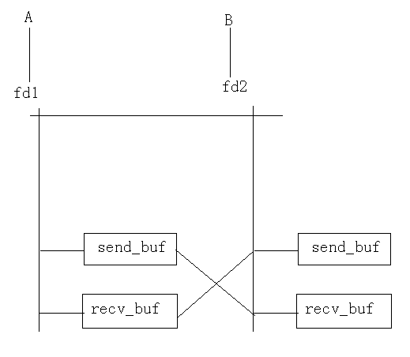

# linuxc

## APUE

[Linux高级编程](./apue/README.md)

## MMU

虚拟内存管理起到什么作用

- 虚拟内存管理最主要的作用是让每一个进程都有独立的地址空间
- 虚拟内存管理可以控制物理内存的访问权限
- VA到PA的映射会给分配和释放带来方便
- 一个系统如果同时运行很多进程,为各进程分配的内存之和可能会大于实际可用的物理内存,虚拟内存管理使得这种情况下各进程仍然能够正常运行.因为各进程分配的只不过是虚拟内存的页面,这些页面的数据可以映射到物理页面,也可以临时保存到磁盘上而不占用物理页面

## getopt

```shell
optstring a:bc:d::e
-b -e 不接参数(右边没有分隔符)
-d 可接,也可以不接,参数不保存存在optarg中(左右两边都有分隔符)
-a -c 必须要接参数,参数保存在optarg中(右边有分隔符)

比较下面三个结果知道可选参数-d和不接参数-b,-e的区别
./a.out -bed
./a.out -dbe be作为里-d的参数
./a.out -deb be作为里-d的参数
```

## main 函数

我们知道main函数的标准原型应该是如下所示

int main(int argc, char *argv[])

argc 是命令行参数的个数

argv 是一个指向指针的指针,为什么不是指针数组呢?

因为函数原型中的[]表示指针而不表示数组,等价于 char **argv

那为什么要写成char *argv[]而不写成 char **argv 呢?

这样写给读代码的人提供了有用信息,argv 不是指向单个指针,而是指向一个指针数组的首元素

数组中每个元素都是 char *指针, 指向一个命令行参数字符串

## inotify and epoll


```shell
gcc -o inotify inotify.c
mkdir tmp
./inotify tmp &
echo > tmp/1
echo > tmp/2
rm tmp/1 tmp/2
```

```shell
gcc -o epoll epoll.c
mkdir tmp
mkfifo tmp/1 tmp/2 tmp/3
./epoll tmp/1 tmp/2 tmp/3 &
echo aaa > tmp/1
echo bbb > tmp/2
```

```shell
gcc -o inotify_epoll inotify_epoll.c
mkdir tmp
./inotify_epoll tmp/ &
mkfifo tmp/1 tmp/2 tmp/3
echo aaa > tmp/1
echo bbb > tmp/2
rm tmp/3
```

## 内核如何实现信号的捕捉
如果信号的处理动作是用户自定义函数,在信号递达时就调用这个函数,这称为捕捉信号.
由于信号处理函数的代码是在用户空间的,处理过程比较复杂,举例如下:

1. 用户程序注册了 SIGQUIT 信号的处理函数 sighandler.
2. 当前正在执行 main 函数,这时发生中断或异常切换到内核态.
3. 在中断处理完毕后要返回用户态的 main 函数之前检查到有信号 SIGQUIT 递达.
4. 内核决定返回用户态后不是恢复 main 函数的上下文继续执行,而是执行 sighandler 函数,sighandler 和 main 函数使用不同的堆栈空间,它们之间不存在调用和被调用的关系,是两个独立的控制流程。
5. sighandler 函数返回后自动执行特殊的系统调用 sigreturn 再次进入内核态。
6. 如果没有新的信号要递达,这次再返回用户态就是恢复 main 函数的上下文继续执行了。

如下图所示:


## 使用二级指针巧妙删除链表节点

```c
/*
 * delete 的优化版本
 * 不需要对是否是删除头部特殊判断
 * 这里巧用了二级指针操作
 * 一个指向当前节点的二级指针就是其上一节点
 */
void delete_plus(struct node *p)
{
	struct node **pnext;

	for (pnext = &head; *pnext; pnext = &(*pnext)->next)
	{
		if (*pnext == p)
		{
			*pnext = p->next;
			return;
		}
	}
}
```


## 进程

### 引言

每个进程在内核中都有一个进程控制块(PCB)来维护进程相关的信息
Linux内核的进程控制块是 task_struct 结构体,其中有如下信息

- 进程 id,系统中每个进程有唯一的id,在C语言中用pid_t类型表示,其实就是一 个非负整数
- 进程的状态,有运行、挂起、停止、僵尸等状态
- 进程切换时需要保存和恢复的一些CPU寄存器
- 描述虚拟地址空间的信息
- 描述控制终端的信息
- 当前工作目录(Current Working Directory)
- umask 掩码
- 文件描述符表,包含很多指向file结构体的指针
- 和信号相关的信息
- 用户id和组id
- 控制终端、Session 和进程组
- 进程可以使用的资源上限(Resource Limit)

### 特点

- 在各自独立的地址空间中运行
- 共享数据需要mmap或者进程间通信机制


### 守护进程

概念: 没有控制终端,不能直接和用户交互,一直在运行着

#### 如何创建一个守护进程

创建守护进程最关键的一步是调用setsid函数创建一个新的Session,并成为Session Leader

### 进程间通信

- 父进程通过 fork 可以将打开文件的描述符传递给子进程
- 子进程结束时,父进程调用 wait 可以得到子进程的终止信息
- 几个进程可以在文件系统中读写某个共享文件,也可以通过给文件加锁来实现进程间同步
- 进程之间互发信号,一般使用 SIGUSR1 和 SIGUSR2 实现用户自定义功能
- 管道(pipe,只能在亲属进程间)
- FIFO(有名管道,可以在不同进程间)
- mmap 函数,几个进程可以映射同一内存区
- SYSV IPC,以前的SYSV UNIX系统实现的IPC机制,包括消息队列,信号量和共享内存,现在已经基本废弃
- UNIX Domain Socket,目前最广泛使用的 IPC 机制

## 线程

线程共享以下进程资源

- 文件描述符表
- 每种信号的处理方式(SIG_IGN SIG_DFL或自定义的信号处理函数)
- 当前工作目录
- 用户id和组id

但是有些资源每个线程各有一份

- 线程id
- 上下文,包括各寄存器的值,程序计数器和栈指针
- 栈空间
- errno变量
- 信号屏蔽字
- 调度优先级

### 关于id

- 进程id的类型是pid_t,每个进程的id在整个系统中是唯一的,调用getpid可以获得当前进程的id
- 线程id的类型是thread_t,它在当前进程中保证唯一,在不同系统中thread_t有不同的实现,可能是一个整数,也可能是一个结构体,也可能是一个地址,所以不能简单的当成整数用printf打印,调用pthread_self可以获得当前线程的id

### 终止线程

只终止某个线程而不终止整个进程

- 从线程函数return(对主线程不合适)
- 一个线程可以调用pthread_cancel终止同一个进程中的另一个线程(分同步和异步)
- 线程可以调用pthread_exit终止自己

### pthread_join

	int pthrad_join(pthread_t thread, void **value_ptr);

调用该函数的线程将挂起等待,知道id为thread的线程终止
thread线程以不同的方法终止,通过pthread_join得到的终止状态是不同的

- 如果thread线程通过return返回,value_ptr所指向的单元里存放的是thread线程函数的返回值
- 如果thread线程被别的线程调用pthread_cancel异常终止掉,value_ptr所指向的单元里存放的是常数PTHREAD——CANCELED
- 如果thread线程是自己调用pthread_exit终止的,value_ptr所指向的单元存放的是传递给pthread_exit的参数

如果对thread线程的终止状态不感兴趣,可以传NULL给value_ptr参数

## Mutex(线程间同步)
写程序时应该尽量避免同时获得多个锁,如果一定有必要这么做,则有一个原则:

### 如果所有线程在需要多个锁时都按相同的先后顺序(常见的是按Mutex变量的地址顺序)获得锁, 则不会出现死锁。

比如一个程序中用到锁 1、锁 2、锁 3,它们所对应的Mutex 变量的地址
是 锁1< 锁2< 锁3,那么所有线程在需要同时获得 2 个或 3 个锁时都应该按锁1、锁2、锁 3的顺序获得。
如果要为所有的锁确定一个先后顺序比较困难,则应该尽量使用 pthread_mutex_trylock调用代替pthread_mutex_lock调用,以免死锁。

## 信号量(Semaphore)
信号量(Semaphore)和Mutex类似,表示可用资源的数量,和Mutex不同的是这个数量可以大于1
本节介绍的是 POSIX semaphore 库函数,详见sem_overview(7)
这种信号量不仅可用于同一进程的线程间同步,也可用于不同进程间的同步.

## 内存分配
C标准库里的3个分配函数
malloc 不负责把分配的内存空间清零
calloc 会负责把分配的内存空间用字节0填充
realloc 调整已分配的内存大小

POSIX标准中定义的分配函数
alloca
不是在堆上分配空间,而是在调用者函数的
栈帧上分配空间,类似于 C99 的变长数组,当调用者函数返回时自动释放栈帧
所以不需要free
这个函数不属于 C 标准库,而是在 POSIX 标准中定义的。

## 段错误的产生流程
1. 用户程序要访问的一个虚拟地址,经MMU检查无权访问.
2. MMU 产生一个异常,CPU 从用户模式切换到特权模式,跳转到内核代码中执行异常服务程序.
3. 内核把这个异常解释为段错误,把引发异常的进程终止掉.

## SRAM and DRAM
SRAM static RAM(CPU的Cache通常由SRAM组成)
DRAM dynamic RAM(内存通常由DRAM组成)
DRAM电路比SRAM简单,存储容量可以做得更大,但DRAM的访问速度比SRAM慢.

## SocketPair



线程版本

gcc socketpair.c -lpthread

进程版本

gcc socketpair.c -DFORK_VERSION

## Workqueue and Tasklet

[参考文章:tasklet和workqueue ](http://blog.csdn.net/houxn22/article/details/45720247)

[参考文章:软中断,tasklet和工作队列详解](http://blog.csdn.net/godleading/article/details/52971179)

### 两者之间存在一些非常重要的区别

- tasklet在中断上下文中运行,因此所有的tasklet代码都必须是原子的

- 工作队列函数在一个特殊内核进程的上下文中运行,因此它们具有更好的灵活性,尤其是工作队列函数可以休眠

- tasklet始终运行在被初始提交的同一处理器上,但这只是工作队列的默认方式, 内核代码可以请求工作队列函数的执行延迟给定的时间间隔


## C库函数I/O

### 以字节位单位的I/O函数

[代码例子](./misc/byte_io.c)

|函数|效果|
|--|--
|fgetc|从指定的文件中读一个字节
|getchar|从标准输入读一个字节,相当于fgetc(stdin)

fgetc几点说明

- 要用fgetc函数读一个文件,该文件的打开方式必须是可读的
- 每调用一次fgetc读写位置向后移动一个字节,因此可以连续多次调用fgetc函数依次读取多个字节
- 返回值必须转换成int再返回

|函数|效果|
|--|--
|fputc|向指定的文件中写一个字节
|getchar|向标准输出写一个字节,相当于fputc(c, stdout)

fputc使用说明

- 要用fputc函数写一个文件,该文件的打开方式必须是可写的(包括追加)
- 每调用一次fputc,读写位置向后移动一个字节,因此可以连续多次调用fputc函数依次写入多个字节,但如果文件是以追加方式打开的,每次调用fputc时总是将读写位置移到文件末尾然后把要写入的字节追加到后面

### 以字符串为单位的I/O函数(fputs,fgets)

[参考代码](./misc/record.c)

### 以记录为单位的I/O函数

[read参考代码](./misc/record_read.c)

[write参考代码](./misc/record_write.c)

fread和fwrite用于读写记录,这里的记录是指一串固定长度的字节,比如一个int,一个结构体或者一个定长数组,参数size指出一条记录的长度, nmemb指出要读或写多少条记录,这些记录在ptr所指的内存空间中连续存放

## 系统调用I/O


open,read,write,close等系统函数称为无缓冲I/O(Unbuffered I/O)函数

如何选用C库函数和系统调用

- 用Unbuffered I/O函数每次读写都要进内核
- 用C标准I/O库函数要时刻注意I/O缓冲区和实际文件有可能不一致,在必要时需调用fflush
- 网络设备和终端设备读写选用Unbuffered I/O函数

## Poll函数使用

[代码实例](./misc/poll)

## Ext2 FileSystem

[ext2 filesystem](./ext2_fs.md)

## 红黑树

[rbtree](./rbtree)

## Linux进程调度

[参考:深入Linux内核架构](./schedule)
