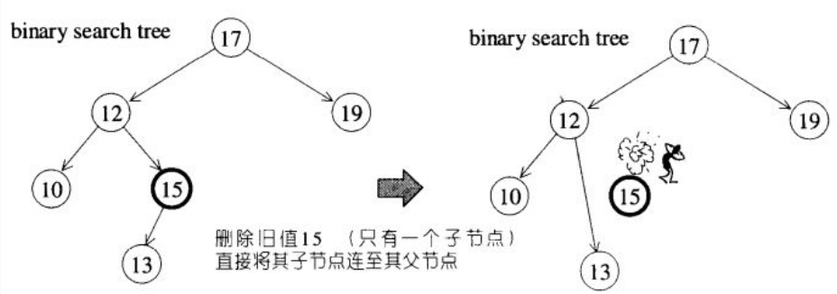
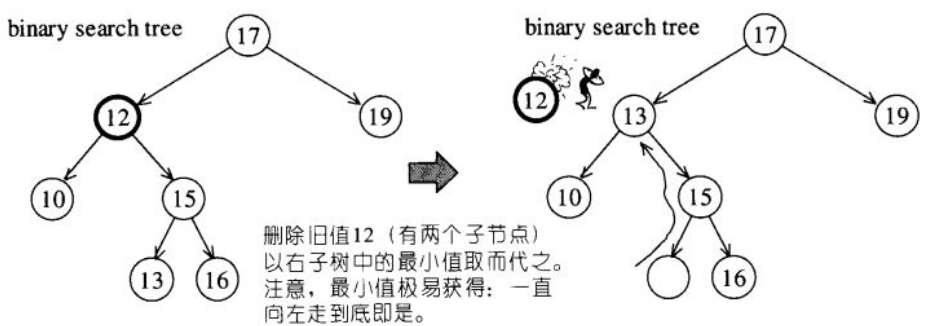
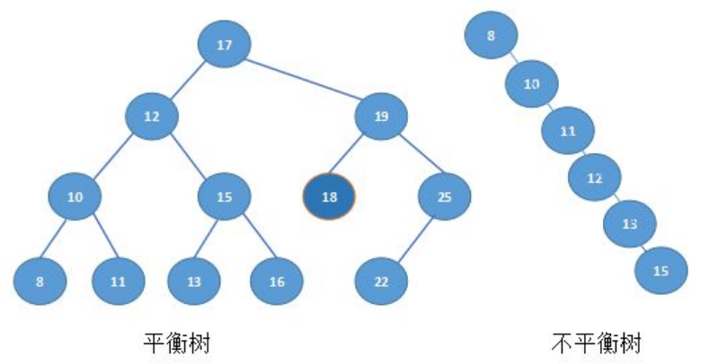

# 二叉树

二叉树:任何节点最多只允许两个子节点

## 二叉排序树

二叉排序树:任何节点的键值一定大于其左子树中的每一个节点的键值,并小于其右子树中的每一个节点的键值

### 二叉排序树删除节点

如果A只有一个子节点,就直接将A的子节点连至A的父节点上,并将A删除

如果A有两个子节点,则以右子树内的最小节点取代A

## 平衡二叉搜索树

由于输入值不够随机,输入顺序的原因,还或许一些插入,删除操作,会使得二叉搜索树失去平衡,造成搜索效率低落的情况

比如上面两个树,在平衡树上寻找15就只要2次查找,在非平衡树上却要5次查找方能找到,效率明显下降

平衡二叉树(AVL tree)要求任何节点的左右节点的左右子树高度差不超过1
