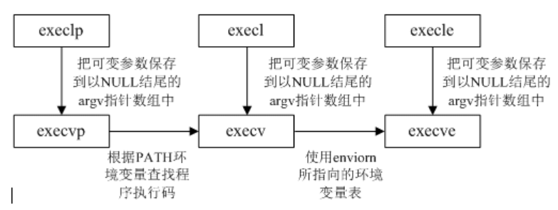

# EXEC族函数解析

[Linux中exec函数](https://blog.csdn.net/zhengqijun_/article/details/52852074)

## 简介

fork函数是用于创建一个子进程,该子进程几乎是父进程的副本,而有时我们希望子进程去执行另外的程序,
exec函数族就提供了一个在进程中启动另一个程序执行的方法.
它可以根据指定的文件名或目录名找到可执行文件,
并用它来取代原调用进程的数据段,代码段和堆栈段,在执行完之后,
原调用进程的内容除了进程号外,其他全部被新程序的内容替换了.
另外,这里的可执行文件既可以是二进制文件,也可以是Linux下任何可执行脚本文件

## 在Linux中使用exec函数族主要有以下两种情况

- 当进程认为自己不能再为系统和用户做出任何贡献时,就可以调用任何exec函数族让自己重生.
- 如果一个进程想执行另一个程序,那么它就可以调用fork函数新建一个进程,然后调用任何一个exec函数使子进程重生

## 函数接口

```c
int execl(const char *path, const char *arg, ...
			   /* (char  *) NULL */);
int execlp(const char *file, const char *arg, ...
			   /* (char  *) NULL */);
int execle(const char *path, const char *arg, ...
			   /*, (char *) NULL, char * const envp[] */);
int execv(const char *path, char *const argv[]);
int execvp(const char *file, char *const argv[]);
int execvpe(const char *file, char *const argv[],
			   char *const envp[]);
```

- 不带p的的函数需要使用绝对路径指明应用程序
- 带p的函数会在环境变量中查找相应的程序
- 带e的表示可以设置环境变量
- 带l的表示传递参数是使用的list方式
- 带v的表示传递参数是使用的vector方式



## exec函数族使用注意点

- 找不到文件或路径,此时errno被设置为ENOENT
- 数组argv和envp忘记用NULL结束,此时errno被设置为EFAULT
- 没有对应可执行文件的运行权限,此时errno被设置为EACCES
