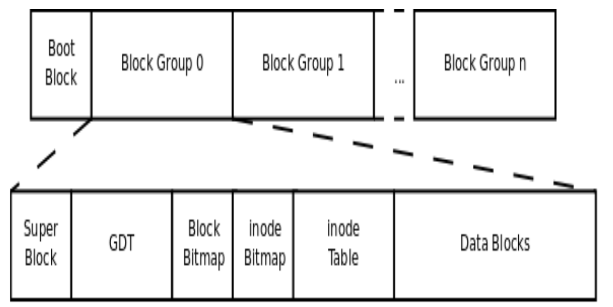

# Linux FileSystem

## Ext2

ext2文件系统总体存储布局

- 文件系统中存储的最小单位是块(Block),一个块究竟多大实在格式化的时候确定的

- 启动块(Boot Block)大小是由PC标准规定的1KB,用来存储磁盘分区信息和启动信息,任何文件系统都不能使用启动启动块

- 启动块之后才是ext2文件系统的开始,ext2文件系统将整个分区划分成若干个同样大小的块组(Block Group)

每个块组由以下部分组成

- 超级块(Super Block)
- 块组描述符号表(GDT Group Descriptor Table)
- 块位图(Block Bitmap)
- inode位图(inode Bitmap)
- inode表(inode Table)
- 数据块(Data Block)

### 超级块(Super Block)

描述整个分区的文件系统信息,例如块大小,文件系统版本号，上次mount的时间,超级块在每个块组的开头都有一份拷贝

数据结构

	struct ext2_super_block

### 块组描述符表(GDT Group Descriptor Table)

- 存储块组相关信息,比如块组中从哪里开始是inode表,从哪里开始是数据块,空闲的inode和数据块有多少
- 通常内核只用到第0个块组中的描述符,当执行e2fsck检查文件系统一致性时,第0个块组中的超级块和块组描述符表就会拷贝到其它块组,这样当第0个块组的开头意外损坏时就可以用其它拷贝来恢复,从而减小损失

数据结构

	struct ext2_group_desc
	{
		__le32  bg_block_bitmap;        /* Blocks bitmap block */
		__le32  bg_inode_bitmap;        /* Inodes bitmap block */
		__le32  bg_inode_table;     /* Inodes table block */
		__le16  bg_free_blocks_count;   /* Free blocks count */
		__le16  bg_free_inodes_count;   /* Free inodes count */
		__le16  bg_used_dirs_count; /* Directories count */
		__le16  bg_pad;
		__le32  bg_reserved[3];
	};

### 块位图(Block Bitmap)

- 描述整个块组中哪些块已用,哪些块空闲,它本身占一个块,其中的每个bit代表块组中的一个块

- df命令统计整个磁盘已用空间非常快是因为只需要查看每个块组的块位图即可,不需要遍历整个分区
相反,du命令查看一个目录的已用空间就非常慢,因为不可避免的要遍历整个目录的所有文件

#### 在格式化一个分区时究竟会划分多少个块组

- 因为块位图本身必须只占一个块,用mke2fs格式化时默认块大小是1024Byte

- 现在假设块大小是n(byte),那么一个块就有8n(bit),这样一个块位图就可以表示8n个块的占用情况
因此一个块组最多可以有8n个块

- 如果整个分区有m个块,那么就可以有m/8n个块组,格式化时可以用-g来指定一个块组有多少个块,当通常不需要手动指定,mke2fs工具会算出最优的数值

### inode位图(inode Bitmap)

和块位图类似,本身占一个块,其中每个bit表示一个inode是否空闲可用

### inode表(inode Table)

存储文件的描述信息,非文件数据本身,每个文件都有一个inode,一个块组中所有inode组成了inode表

inode表占多少个块在格式化的时候就要决定并写入块组描述符中,mke2fs格式化工具的默认策略是一个块组有多少个8KB就分配多少个inode,由于数据块占据了整个块组的绝大部分,所以也可以近似认为数据块有多少个8KB就分配多少个inode

更贴切的说,如果平均每个文件的大小是8KB,当分区存满的时候inode表会得到比较充分的利用,数据块也不浪费,如果这个分区存储的都是很大的文件(比如电影)则数据块用完的时候inode会有些浪费,如果这个分区存储的都是很小的文件(比如源码)则有可能数据块还没用完inode就已经用完了,数据块可能有很大的浪费,所以如果用户在格式化时能够对这个分区以后要存储的文件大小做一个预测,也可以用mke2fs的-i参数手动指定每多个字节分配一个inode

### 数据块(Data Block)

- 对于常规文件,文件的数据类型存储在数据块中
- 对于目录,该目录下的所有文件名和目录名存储在数据块中
- 对于符号连接,如果目标路径名较短则直接保存在inode中以便更快查找,如果目标路径名较长则分配一个数据块来保存
- 设备文件,FIFO,socket等特殊文件没有数据块,设备文件的主设备号和次设备号保存在inode中

## 实验

创建一个1MB的文件并清零

	dd if=/dev/zero of=fs count=256 bs=4K

格式化

	mke2fs fs

查看相应的信息

	dumpe2fs fs

### 结果分析如下

- 块大小是1024Byte,1MB的分区共有1024个块,第0个块是启动块,启动块之后才是ext2文件系统的开始
- Group0占据第1到第1023个块共1023个块,块位图占一个块,所以有1024x8=8192bit,足够表示这1023个块,因此只要一个块组就够了,默认是没8KB分配一个inode,因此1MB的分区共128个inode
