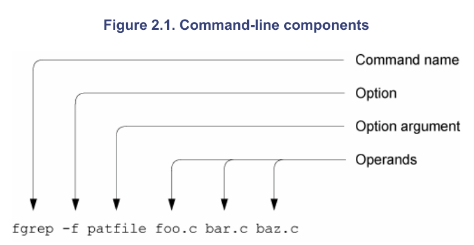

# getopt函数的使用



## optsting的判断规则

```shell
假设有如下optstring a::b:c:d

看字符右边是否有":"
optstring 中的每一个字符都表示一个option
每一个可带参数的option后面的参数叫做option argument(optarg)
可带参数的选项参数保存在optarg中

单个字符d			表示选项d没有参数         格式:	-d即可,不加参数
单字符加冒号b:		表示选项b有且必须加参数   格式:	-b 100 或 -b100,但-b=100错
单字符加冒号c:		表示选项c有且必须加参数   格式:	-c 100 或 -c100,但-c=100错
单字符加2冒号a::		表示选项a可以有,也可以无  格式:	-a 或 -a200
```
