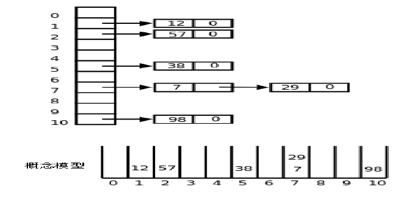

# 哈希表

- 首先分配一个指针数组,数组的每个元素是一个链表的头指针,每一个链表称为一个槽(slot)
- 哪个数据放入到哪个槽由哈希函数决定,上图中的哈希函数是h(x) = x % 11
- 如果每个槽中至多只有一个数据,那么search,insert,delete操作的时间复杂度就是O(1)
- 如果多个数据被哈希函数映射到同一个槽中,这称为碰撞(Collision),设计一个好的哈希函数可以把数据平均地分布到各个槽中,尽量避免碰撞
- 把n个数据比较均匀的分布到m个槽中,每个槽里约有n/m个数据,则search,insert,delete操作的时间复杂度都是O(n/m)
