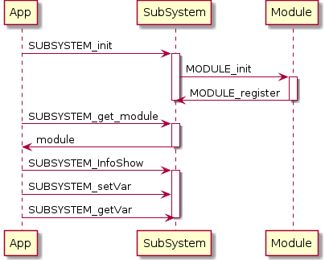

# 编译

直接在顶层目录执行

	make

# 文件说明

main.c 应用模块,最顶层

operations.[ch] 使用list函数的模块,中间层

klist.h	list 操作的所有宏和函数, 最底层

project_common.h 项目公共数据头文件

# skeleton

## Usage

比如要增加一个显示子系统(display)

其中显示子系统里有模块(fb)

subsystem : display_ss.c _ss表示subsystem后缀

module : fb_md.c _md表示module后缀

新建一个子系统

	mkdir display
	cp skeleton/subsystem.c display/display_ss.c
	cp skeleton/module.c display/fb_md.c
	cp skeleton/Makefile display/Makefile
	cp include/SUBSYSTEM_ss.h include/display_ss.h

在vim中将新文件都添加到args中

	:argadd include/display_ss.h display/display_ss.c display/fb_md.c

批量替换

	:argdo! %s/SUBSYSTEM/display/ge | update
	:argdo! %s/MODULE/fb/ge | update

手动修改顶层和子目录Makefile

# example

	gcc example.c -o example -Iinclude
