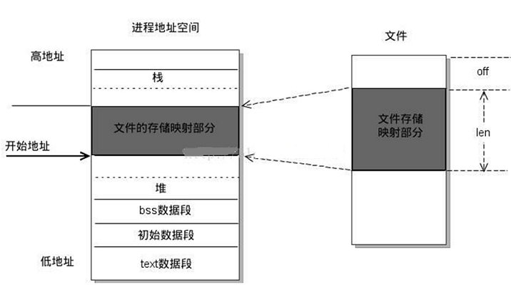

# mmap(文件映射)

[参考文章Linux的mmap内存映射机制解析](https://blog.csdn.net/zqixiao_09/article/details/51088478)

## mmap简介

- mmap把文件内容映射到一段内存上(准确说是虚拟内存上)
- 通过对这段内存的读取和修改,实现对文件的读取和修改
- 普通文件被映射到进程地址空间后,进程可以向访问普通内存一样对文件进行访问,不必再调用read/write等

## 文件映射优点

- 文件映射一方面给用户提供了一组措施,好似用户将文件映射到自己地址空间的某个部分,使用简单的内存访问指令读写文件
- 它也可以用于内核的基本组织模式,在这种模式种,内核将整个地址空间视为诸如文件之类的一组不同对象的映射

传统文件方法(read/write)
- 传统文件访问方式(open/read/write等)进行顺序或者随即的I/O.这种方式是非常低效的,每一次I/O操作都需要一次系统调用
- 另外如果若干个进程访问同一个文件,每个进程都要在自己的地址空间维护一个副本,浪费了内存空间

## 驱动中的mmap函数

- 设备驱动的mmap实现主要是将一个物理设备的可操作区域(设备空间)映射到一个进程的虚拟地址空间
- 这样就可以直接采用指针的方式像访问内存的方式访问设备
- 在驱动中的mmap实现主要是完成一件事,就是实际物理设备的操作区域到进程虚拟空间地址的映射过程
- 同时也需要保证这段映射的虚拟存储器区域不会被进程当做一般的空间使用,因此需要添加一系列的保护方式

```c
/* 主要是建立虚拟地址到物理地址的页表关系,其他的过程又内核自己完成 */
static int mem_mmap(struct file* filp,struct vm_area_struct *vma)
{
    /* 间接的控制设备 */
    struct mem_dev *dev = filp->private_data;

    /* 标记这段虚拟内存映射为IO区域,并阻止系统将该区域包含在进程的存放转存中 */
    vma->vm_flags |= VM_IO;

    /* 标记这段区域不能被换出 */
    vma->vm_flags |= VM_RESERVED;

    if(remap_pfn_range(vma,/* 虚拟内存区域 */
        vma->vm_start, /* 虚拟地址的起始地址 */
        virt_to_phys(dev->data)>>PAGE_SHIFT, /* 物理存储区的物理页号 */
		dev->size,    /* 映射区域大小 */
        vma->vm_page_prot /* 虚拟区域保护属性 */))
        return -EAGAIN;

    return 0;
}
```

两个关键的标志位

	vma->vm_flags |= VM_IO;
	vma->vm_flags |= VM_RESERVED;

两个保护机制就说明了被映射的这段区域具有映射IO的相似性,同时保证这段区域不能随便的换出

虚拟页和物理页建立联系
具体原理是虚拟页和物理页之间是以页表的方式关联起来
虚拟内存通常大于物理内存,在使用过程中虚拟页通过页表关联一切对应的物理页
当物理页不够时,会选择性的牺牲一些页,也就是将物理页与虚拟页之间切断,重现关联其他的虚拟页,保证物理内存够用

mmap的作用是映射文件描述符fd指定文件的 [off,off + len]区域至调用进程的[addr, addr + len]的内存区域



[实例1](./mmap1.c)

[实例2](./mmap2.c)

## mmap和共享内存对比

共享内存

- 共享内存允许两个或多个进程共享给定的存储区,因为数据不需要来回复制,所以是最快的一种进程间通信机制
- 共享内存可以通过mmap映射普通文件(特殊情况下还可以采用匿名映射)机制实现,也可以通过SystemV共享内存机制实现
- 共享内存应用接口和原理很简单,内部机制复杂.为了实现更安全通信,往往还与信号灯等同步机制共同使用

两者区别
- mmap机制就是在磁盘上建立一个文件,每个进程虚拟地址空间里面,单独开辟一个空间来进行映射
	如果多进程的话,那么不会对实际的物理内存消耗太大
- shm机制,每个进程的共享内存都直接映射到实际物理内存里面
- mmap保存到硬盘上(因为是文件映射,文件保存在硬盘上),实际存储并没有反映到内存上(因为用的是映射到的是进程的虚拟地址空间)
	优点:储存量可以很大(多于内存)
	缺点:进程间读取和写入速度要比直接操作内存的要慢(这里说的慢应该指的是相对于只操作内存)
- shm保存到物理内存,实际的储存量(本身就是操作的物理内存)直接反映到物理内存上
	优点:进程间访问速度(读写)比操作磁盘要快
	缺点:储存量不能非常大(不能大于实际物理内存)

结论:如果分配的存储量不大,那么使用shm,如果存储量大,那么使用mmap
