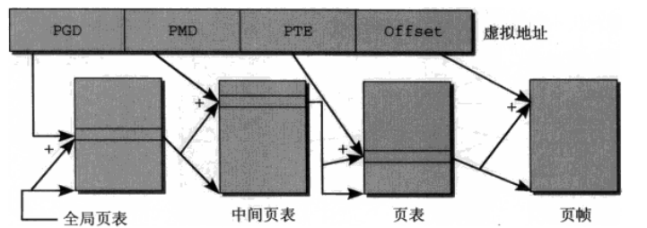
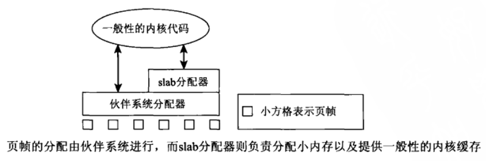

# 虚拟内存管理起到什么作用

- 虚拟内存管理最主要的作用是让每一个进程都有独立的地址空间
- 虚拟内存管理可以控制物理内存的访问权限
- VA到PA的映射会给分配和释放带来方便
- 一个系统如果同时运行很多进程,为各进程分配的内存之和可能会大于实际可用的物理内存,虚拟内存管理使得这种情况下各进程仍然能够正常运行.因为各进程分配的只不过是虚拟内存的页面,这些页面的数据可以映射到物理页面,也可以临时保存到磁盘上而不占用物理页面

## 页表

将虚拟地址空间映射到物理地址空间的数据结构称为页表

下图是一个三级页表结构

### PGD(Page Global Directory)

用于索引进程中的一个数组(每个进程有且仅有一个),数组项指向另一些数组起始地址即PMD

### PMD

PMD的数组项也是指针,指向PTE

### PTE(Page Table Entry)

用作页表索引,虚拟内存页和页帧之间的映射就此完成,因为页表的数组项指向页帧

### Offset

指定了页内部的一个字节位置

### 使用页表的优缺点

- 对虚拟地址空间不需要的区域,不必创建中间页目录或页表,多级页表相比当个数组的实现节省内存
- 每次访问内存时,必须逐级访问多个数组才能将虚拟地址转换为物理地址

### 加速VA到PA的过程

- 使用MMU单元优化内存操作
- 对于转换频繁的地址保存到TLB(Translation Lookside Buffer)中

## 物理内存的分配

### 伙伴系统

内核中很多时候要求分配连续页.为快速检测内存中的连续区域,内核采用伙伴系统

### slab缓存

### 页面交换和页面回收

- 页面交换通过利用磁盘空间作为扩展内存,从而增大了可用的内存(通过缺页异常机制来换回页)
- 页面回收用于将内存映射被修改的内存与底层块设备同步
