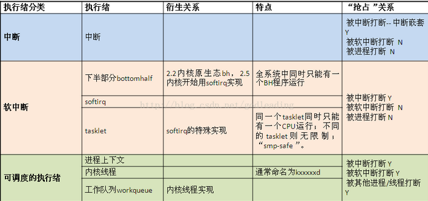

# Workqueue and Tasklet

[参考文章:tasklet和workqueue ](http://blog.csdn.net/houxn22/article/details/45720247)

[参考文章:软中断,tasklet和工作队列详解](http://blog.csdn.net/godleading/article/details/52971179)

## 两者之间存在一些非常重要的区别

- tasklet在中断上下文中运行,因此所有的tasklet代码都必须是原子的

- 工作队列函数在一个特殊内核进程的上下文中运行,因此它们具有更好的灵活性,尤其是工作队列函数可以休眠

- tasklet始终运行在被初始提交的同一处理器上,但这只是工作队列的默认方式, 内核代码可以请求工作队列函数的执行延迟给定的时间间隔

