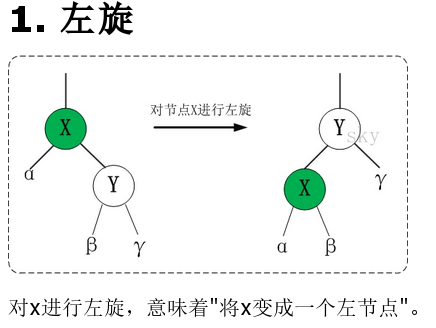
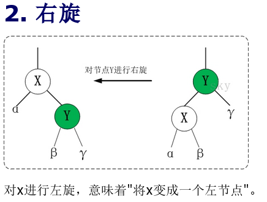

# R-B Tree

[参考文章 红黑树](http://www.cnblogs.com/skywang12345/p/3245399.html)

## 什么是红黑树

红黑树是特殊的二叉查找树,意味着它满足二叉查找树的特征:任意一个节点所包含的键值,大于等于左孩子的键值，小于等于右孩子的键值.红黑树的每个节点都有存储位表示节点颜色

## 特性

1. 每个节点或者是红色,或者是黑色
2. 根节点是黑色
3. 每个叶子节点(NIL, NULL)是黑色
4. 如果一个节点是红色,则它的字节点必须是黑色
5. 从一个节点到该节点的子孙节点的所有路径上包含相同数目的黑节点

## 应用

主要是用它来存储有序的数据,它的时间复杂度是O(lgn),Linux虚拟内存的管理就是用红黑树实现的

## 基本操作

红黑树的基本操作是添加,删除.在对红黑树进行添加或删除之后,都会用到旋转方法来保持红黑树的特性

### 基本操作一(旋转)

#### 左旋

被旋转的节点将变成左节点

#### 右旋

被旋转的节点将变成右节点

### 基本操作二(添加)

- 将红黑树当作一颗二叉查找树,将节点插入

	红黑树本身就是一颗二叉查找树,将节点插入后,该树仍然是一颗二叉查找树.也就意味着,树的键值仍然是有序的.此外,无论是左旋还是右旋,若旋转之前这棵树是二叉查找树,旋转之后它一定还是二叉查找树.这也就意味着,任何的旋转和重新着色操作,都不会改变它仍然是一颗二叉查找树的事实

- 将插入的节点着色为红色

	将插入的节点着色为红色,不会违背红黑树第5条特性,少违背一条特性,就意味着我们需要处理的情况越少

- 通过一系列的旋转或着色等操作,使之重新成为一颗红黑树

	插入一个新节点只有可能会违背红黑树特性第4点

### 基本操作三(删除)

- 将红黑树当作一颗二叉查找树,将节点删除
- 通过"旋转和重新着色"等一系列来修正该树,使之重新成为一棵红黑树

## C语言实现

[rbtree.h](./rbtree.h)

[rbtree.c](./rbtree.c)

[rbtree_test.c](./rbtree_test.c)
