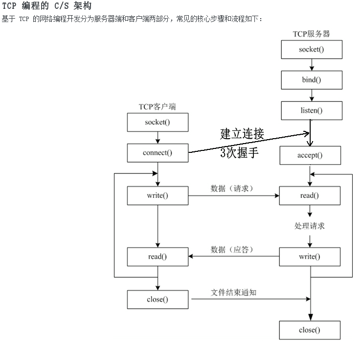

# TCP 编程的C/S架构

由于客户端不需要固定的端口,因此不必调用bind,客户端的端口号由内核自动分配

注意:
- 客户端不是不允许调用bind,只是没有必要调用bind固定一个端口号
- 服务器也不是必须调用bind,只是如果服务器不固定端口号,不方便客户端连接

实验:

在客户端connect()代码之后插入一个while(1);死循环,使客户端和服务器都处于连接状态,用netstat查看

服务器IP(192.168.1.224)

	$ ./server &
	$ netstat -apn | grep 8000
	tcp        0      0 0.0.0.0:8000            0.0.0.0:*               LISTEN      3742/server
	tcp        0      0 192.168.1.224:8000      192.168.1.100:59525     ESTABLISHED 3742/server

客户端IP(192.168.1.100)

	$ ./client abcd &
	$ netstat -apn | grep 8000
	tcp        0      0 0.0.0.0:8000            0.0.0.0:*               LISTEN      6466/./server
	tcp        0      0 192.168.1.100:59525     192.168.1.224:8000      ESTABLISHED 8092/./client

应用程序中的一个socket文件描述符对应一个socket pair,也就是源地址:源端口号和目的地址:目的端口号,也对应一个TCP连接

|socket文件描述符|源地址:源端口号|目的地址:目的端口号|状态|
|--|--|--|--
|server中的listen_fd|0.0.0.0:8000|0.0.0.0:\*|LISTEN|
|server中的connect_fd|192.168.1.224:8000|192.168.1.100:59525|ESTABLISHED|
|client中的sock_fd|192.168.1.100:59525|192.168.1.224:8000|ESTABLISHED|

# 错误处理和读写控制

- 为使错误处理的代码不影响主程序的可读性,把和socket相关的一些系统函数加上错误处理代码包装成新函数,做成一个模块wrap.c
- 慢系统调用accept,read,write被信号中断时应该重试
- connect虽然也会阻塞,但是被信号中断时不能立刻重试
- 对于accept如果errno是ECONNABORTED也应该重试
- TCP协议是面向流的,read和write调用的返回值往往小于参数指定的字节数

## read和write

- 对于read调用:如果接收缓冲区中有20字节,请求读100字节,就会返回20
- 对于write调用:如果请求写100字节,而发送缓冲区中只有20个字节的空闲位置,那么write会阻塞,直到把100个字节全部交给发送缓冲区才返回,但如果socket文件描述符有O_NONBLOCK标志,则write不阻塞,直接返回20
